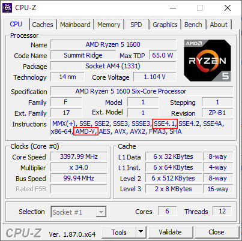

# VMware AMD Hackintosh

I see that you want to make a macOS VM in VMware on your AMD CPU but have no idea how or you need a macOS virtual machine. You've come to the right place. This guide was written for Windows. It may work in Linux but no guarantees.

## Message for FX/A-Series APU users:

There is a bug for these CPUs in Mojave during setup. The setup will get to the "Data & Privacy" page, when you click "Next" setup will crash. I'm not sure if this affects all FXs/APUs, but I've seen it happen on numerous FXs/APUs. 

On a bare metal install of Mojave, there is a workaround by going into single user mode and bascially creating a temporary user to bypass setup. However, that workaround doesn't work on VMware. 

This bug doesn't occur on Catalina, so when Apple releases the 10.15 XNU \(and I release a new installer\), you shouldn't experience these issues. 

I'm sorry if I just crushed your dreams of making a macOS VM, but you'll get a chance to make one soon. 

Since we're on the topic of bugs, if you've got an affected CPU and you want this bug to be resolved, do a bit of experimenting and let me know how you go. I don't have an FX/A-Series CPU to experiment with myself, so have fun bug hunting. I'll make sure to add your name in the Credits section too.

Thank you for understanding. Now, back to the guide.

## Some tips to remember:

Make sure that Virtualization/AMD-V is supported by your CPU and is enabled in your BIOS. CPUs made from around 2006 or newer should supports this but always good to check.

Your CPU also needs to support the SSE4.1 instruction set in order to run macOS Sierra and newer. CPUs made from around 2009 or newer should support this but like I said before, always good to check. You can use [CPU-Z](https://www.cpuid.com/softwares/cpu-z.html) to check if you're not sure. 

Due to VMware's graphics acceleration not being compatible with macOS, you will not have any graphics acceleration in your virtual machine. Things like the Launchpad will be extremely laggy, the Dock will be opaque and the virtual machine will not have multiple monitor support.

Apple's online services \(App Store, iCloud, iMessage, FaceTime & Siri\) will not work in your virtual machine.

Do not update you virtual machine. The AMD kernel is only built for 10.14.3 and you will break your virtual machine if you update it.

