# Post Installation Tweaks

Your VM may be ready to go, but I've got a couple of tweaks you can do to tidy up your VM. These tweaks are all optional, however if you want to use the App Store on your VM, you will need to do the first tweak. Use the "Contents" list to the right of this page to go to certain tweaks.

## Getting the Mac App Store working

I highly recommend creating a new Apple ID or using an Apple ID you don't care about. If something does happen, you don't want your main Apple ID to be blacklisted. You have been warned!

A basic rundown of what's going on: We're changing the SMBIOS product name to a real Mac and generating a serial number for that product name, so we can connect to the Mac App Store under the name of a proper Mac.

#### Prerequisites

* [Clover Configurator](https://mackie100projects.altervista.org/download-clover-configurator/) \(we are not using Clover. We only want Clover Configurator to generate an SMBIOS\)

#### Steps

Download the latest version of Clover Configurator \(Global Edition\).

When you try to open Clover Configurator, you will most likely have this error pop up and it will refuse to open. This is just macOS' security system kicking in. Let's fix that, so we can actually use the app.

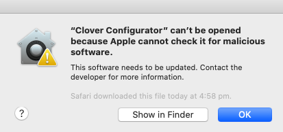

Open System Preferences \(click the back button if Software Update pops up\)

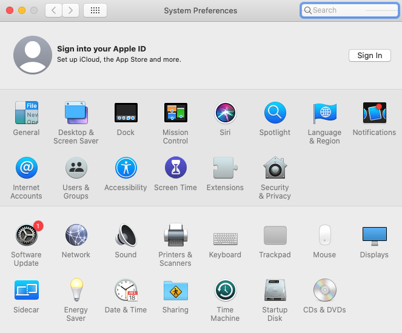

Click "Security & Privacy". macOS will show you that it stopped Clover Configurator from opening. Click "Open Anyway".

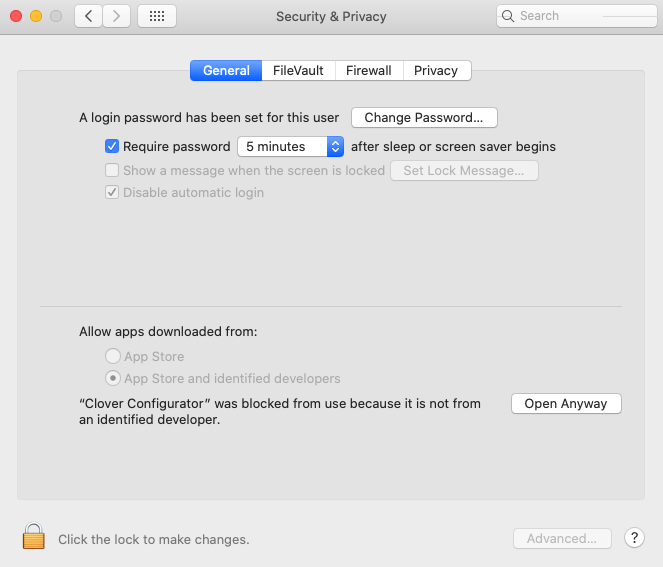

macOS will annoy us again, asking us if we're 100% sure we want to open Clover Configurator. Click "Open", as we are 100% sure.

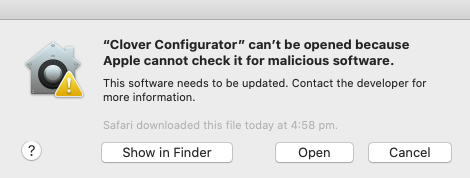

See, nothing malicious about this. Nothing blew up... I hope.

Click on "SMBIOS" on the left panel.

Click on these arrows.

Select iMacPro1,1.

Once it generates the SMBIOS details, note down the Product Name, Serial Number, Board-ID, and Board Serial Number. Don't be lazy, make sure you actually generate your own SMBIOS! You might regret it later on if you just copy mine.

Click on "Rt Variables" in the left panel. Generate a ROM number and note it down somewhere.

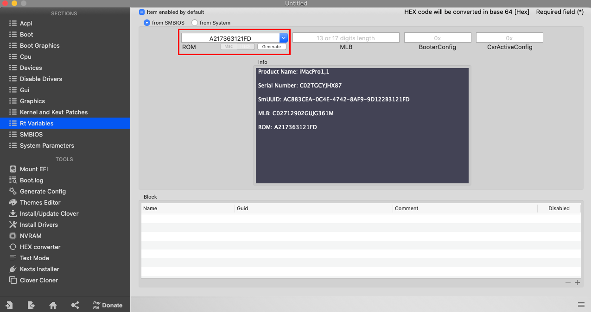

Close Clover Configurator, clicking "Delete" if this message pops up

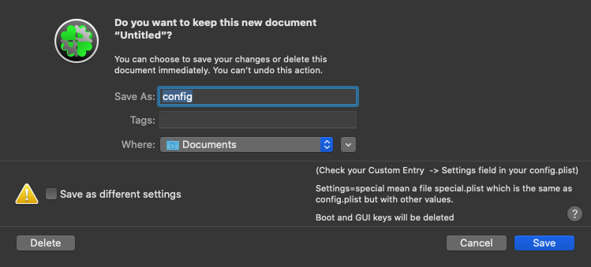

Shutdown your VM and navigate to `your Documents folder/Virtual Machines/macOS 10.15 (or whatever you named your VM to)` and open `macOS 10.15 (or whatever you named your VM to).vmx` in a text editor. 

Find `board-id.reflectHost = "TRUE"` and change it to `"FALSE"`.

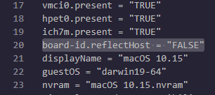

Add these lines to the end of your VMX file. Replace "AAA" with the Board ID you noted down earlier \(you did note it down, did you?\), "BBB" with your Product Name, "CCC" with your Serial Number, "DDD" with your ROM number, and "EEE" with your Board Serial Number.

* board-id = "AAA"
* hw.model.reflectHost = "FALSE"
* hw.model = "BBB"
* serialNumber.reflectHost = "FALSE"
* serialNumber = "CCC"
* smbios.reflectHost = "FALSE"
* efi.nvram.var.ROM.reflectHost = "FALSE"
* efi.nvram.var.MLB.reflectHost = "FALSE"
* efi.nvram.var.ROM = "DDD"
* efi.nvram.var.MLB = "EEE"

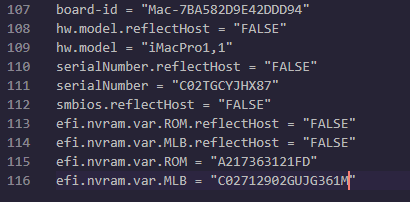

We also need to change the VM's MAC address. 

Find `ethernet0.addressType = "generated"` and change `"generated"` to `"static"`. 

Change `ethernet0.generatedAddress = "xx:xx:xx:xx:xx:xx"` to `ethernet0.Address = "FFF"`, replacing "FFF" with a MAC address from [this website](https://hwaddress.com/company/apple-inc/). Make sure you copy the "Unix Zero-padded" type.

Change `ethernet0.generatedAddressOffset = "0"` to `ethernet0.checkMACAddress = "false"`.

Start your VM and try to log into the App Store. You'll notice in About This Mac, the machine will say iMac Pro \(2017\) and have a proper serial number. That means you've done the steps correctly.

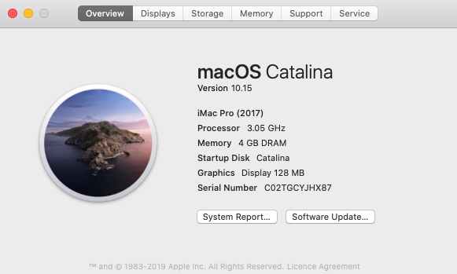

Enjoy the Mac App Store!

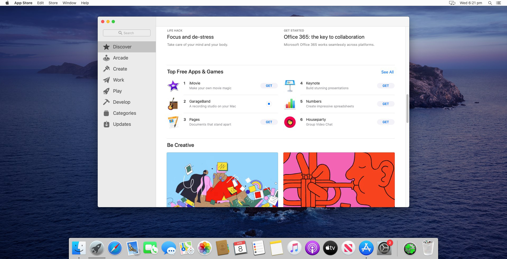

## Enabling verbose booting

If you like the look of verbose booting, here's how to enable it.

#### Prerequisites

* A working keyboard

#### Steps

Open Terminal.

Type `sudo nvram boot-args="-v"`. You may be prompted for your password.

That's it. No, I'm serious, that's it. Reboot your VM and make sure verbose boot is working.

If you ever want to disable it, open Terminal and type sudo nvram "boot-args="

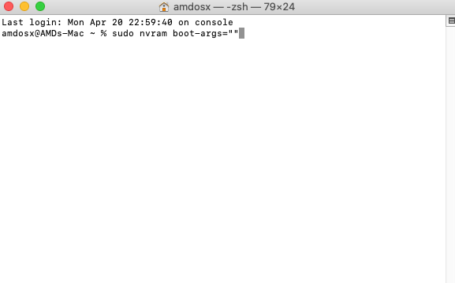

## Removing the recent apps section from the dock

You may notice that ever since 10.14, there is a recently-opened apps section on the dock. If you're like me and find this annoying, here's how to remove it.

#### Prerequistics

* A calm mind. I know it's annoying, but it's not _that_ annoying.

#### Steps

Open System Preferences and click "Dock"

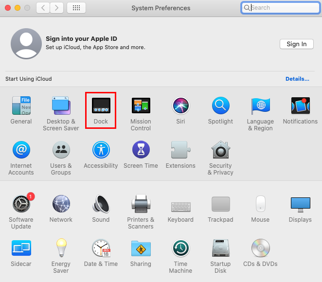

Untick "Show recent applications in Dock"

You'll notice that the recent apps section vanishes away from the dock. That's it, pretty simple fix. 

## Disabling auto-update to prevent macOS downloading and installing updates

Spoiler alert: this is also a quick fix

#### Prerequisites

* A working keyboard
* A working mouse

#### Steps

Open System Preferences \(or click the back arrow if you've still got it open from the last tweak\) and click "Software Update". Untick "Automatically keep my Mac up-to-date", since we know that updating this machine would break it.

After that, click on "Advanced" and untick "Check for updates". The rest of the checkboxes will untick as well. Enter your machine's password if it asks you.

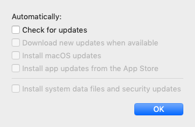

See, very quick and easy fix. Just so you know, you can install the other updates \(Safari, iTunes, etc\). Just don't install the macOS 10.15.4 update or any security updates \(you shouldn't get any of those on 10.15.0 anyway\)

## Removing the macOS installer from the VM

If you've changed your Finder settings to show your hard drives on your desktop. you may notice that the CatalinaAMD installer is still mounted to your virtual machine. This tweak can help you prevent accidently modifying your installer in case you need it in the future.

#### Prerequisites 

* I can't think of a joke to add here

#### Steps

Shutdown your VM if it's powered on. macOS doesn't like it when SATA drives are hotswapped.

_do i really need to add a screenshot showing you how to shutdown macOS?_

Open your VM's settings and select "Hard Disk 2 \(SATA\)", it should be 9.2 GB under "Summary".

You'll know if you've selected the right drive when the name says "CatalinaAMD.vmdk". Click "Remove" on the bottom of the left panel.

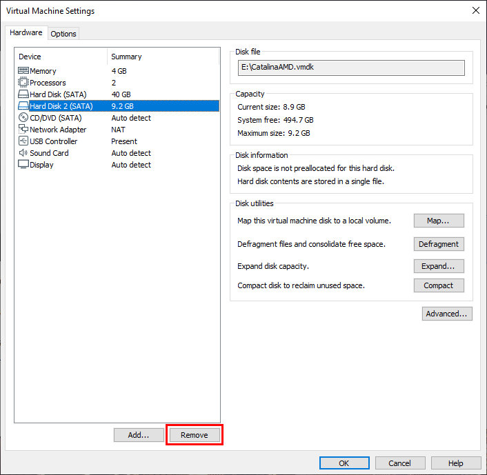

The drive will disappear. Press OK and start your VM.

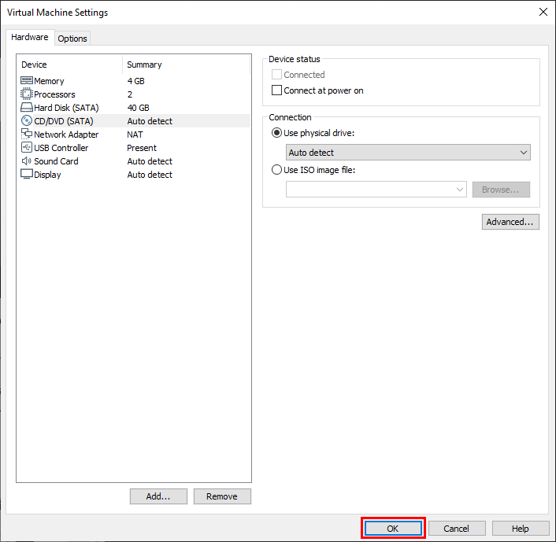

The installer will no longer be mounted to your VM.

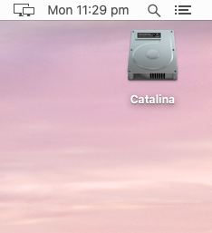

